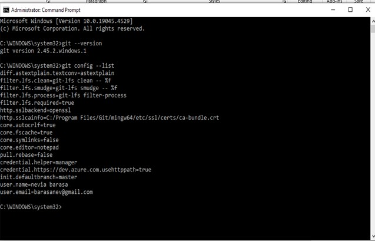
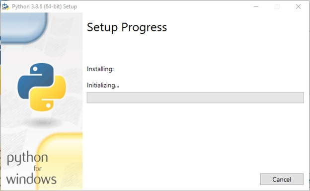

[](https://classroom.github.com/a/vbnbTt5m)
[](https://classroom.github.com/online_ide?assignment_repo_id=15284219&assignment_repo_type=AssignmentRepo)
# Dev_Setup
Setup Development Environment

#Assignment: Setting Up Your Developer Environment

#Objective:
This assignment aims to familiarize you with the tools and configurations necessary to set up an efficient developer environment for software engineering projects. Completing this assignment will give you the skills required to set up a robust and productive workspace conducive to coding, debugging, version control, and collaboration.

#Tasks:

1. Select Your Operating System (OS):
   Choose an operating system that best suits your preferences and project requirements. Download and Install Windows 11. https://www.microsoft.com/software-download/windows11


What’s needed.

1.	Windows installation media. This could be an installation ISO or DVD.
2.	USB flash drive with at least 5GB free space,ensure the flash disk has nothing important since it will be formatted.
3.	Technician PC - Windows PC that you'll use to format the USB flash drive
4.	Destination PC - A PC that you'll install Windows on

Step 1 - Format the drive and set the primary partition as active.
1.	Connect the USB flash drive to your technician PC.
2.	Open Disk Management: Right-click on Start and choose Disk Management.
3.	Format the partition: Right-click the USB drive partition and choose Format. Select the FAT32 file system to be able to boot either BIOS-based or UEFI-based PCs.
4.	Set the partition as active: Right-click the USB drive partition and click Mark Partition as Active.

Step 2 - Copy Windows Setup to the USB flash drive.
1.	Use File Explorer to copy and paste the entire contents of the Windows product DVD or ISO to the USB flash drive.
2.	Optional: add an unattend file to automate the installation process. For more information, see Automate Windows Setup.


Step 3 - Install Windows to the new PC.
•	Connect the USB flash drive to a new PC.
•	Turn on the PC and press the key that opens the boot-device selection menu for the computer, such as the Esc/F10/F12 keys. Select the option that boots the PC from the USB flash drive.
•	Windows Setup starts. Follow the instructions to install Windows.
•	Remove the USB flash drive.

Challenges and Solutions When Installing Windows 11

1. System Requirements:
- Challenge: Requires TPM 2.0, Secure Boot, specific CPUs.
- Solution: Use [PC Health Check tool](https://www.microsoft.com/en-us/windows/windows-11#pchealthcheck); enable TPM and Secure Boot in BIOS.

2. Disk Space:
- Challenge: Needs at least 64 GB storage.
- Solution: Free up space by deleting files or extending partitions.

3. Installation Media:
- Challenge: Corrupt or improper USB installers.
- Solution: Use [Windows Media Creation Tool](https://www.microsoft.com/software-download/windows11) for a proper bootable USB.

4. Driver Issues:
- Challenge: Outdated/incompatible drivers.
- Solution: Update drivers from manufacturer’s website pre-installation.

5. Data Loss:
- Challenge: Potential data loss.
-  Solution: Back up data to external drives/cloud storage.


2. Install a Text Editor or Integrated Development Environment (IDE):
   Select and install a text editor or IDE suitable for your programming languages and workflow. Download and Install Visual Studio Code. https://code.visualstudio.com/Download


Setting up Visual Studio involves a few steps. Here's a concise step-by-step guide:
Download Visual Studio:
1.	Visit the Visual Studio website and click on "Download Visual Studio."
2.	Follow the on-screen instructions to download the installer.
Run the Installer:
3.	Run the downloaded installer.
4.	Choose the "Visual Studio" workload during installation, which includes the necessary components for general development.
Select Workloads and Components:
5.	In the Visual Studio Installer, select the workloads and components you need based on your development requirements. Common workloads include ".NET Desktop Development" or "Web Development."
Modify Installation (Optional):
6.	If needed, you can customize the installation by clicking on the "Individual components" tab in the installer and selecting or deselecting specific components.
Install:
7.	Click the "Install" button to start the installation process.
8.	This may take some time, as it involves downloading and installing the selected components.
Launch Visual Studio:
9.	Once the installation is complete, launch Visual Studio.
10.	Sign in with your Microsoft account or create one if prompted.
Choose Development Environment:
11.	On the welcome screen, select your development environment. For example, you can choose "Development Settings" based on your preferred coding style.
Start Coding:
12.	You're now ready to start coding! Create a new project or open an existing one to begin your development work.
Challenges and Solutions when installing VS 

Installing Visual Studio Code can present challenges such as compatibility issues, particularly on older operating systems, network restrictions hindering downloads, and missing dependencies like .NET Framework on Windows. Solutions include:

1. Ensuring system requirements are met and updating the OS.
2. Using offline installers if network issues arise.
3. Installing required dependencies manually.
4. Referring to official documentation for troubleshooting.


3. Set Up Version Control System:
   Install Git and configure it on your local machine. Create a GitHub account for hosting your repositories. Initialize a Git repository for your project and make your first commit. https://github.com

Setting Up a Version Control System with Git and GitHub
Step 1: Install Git on Your Local Machine


1. Download Git:
   - Visit the official [Git website](https://git-scm.com/).
   - Click on the download link for your operating system (Windows, macOS, Linux).

2. Install Git:
   - Run the downloaded installer.
   - Follow the installation wizard instructions. Ensure that you:
     - Check the box to use Git from the command line and also from 3rd-party software.
     - Configure the editor (default is Vim, but you can choose VS Code or another preferred editor).
     - Leave other settings at their default values unless you have specific preferences.

3. Verify Git Installation: 
   - Open your terminal or command prompt.
   - Run the following command to verify the installation:
     git --version

 Step 2: Configure Git

1. Set Up Your Identity:
   - Open your terminal or command prompt.
   - Run the following commands to configure your Git username and email
     git config --global user.name "Your Name"
     git config --global user.email "your.email@example.com"

2. Verify Your Configuration: 
   - Run the following command to see your Git configuration:
     git config --list




 Step 3: Create a GitHub Account 

 Sign Up for GitHub:
   - Go to the [GitHub website](https://github.com/).
   - Click on the `Sign up` button in the upper-right corner.
   - Follow the instructions to create a new account.

Step 3: Initialize a Git Repository for Your Project

1. Create a New Project Folder: ( screenshot )
   - Open your terminal or command prompt.
   - Navigate to the directory where you want to create your project:
     cd path/to/your/projects
   - Create a new directory for your project:
     mkdir my-project
     cd my-project


2. Initialize a Git Repository:
   - Initialize a new Git repository in your project directory:
     git init

3. Create a .gitignore File: ( screenshot )
   - Create a `.gitignore` file to specify files and directories to be ignored by Git:
     echo "node_modules/" >> .gitignore
     echo ".env" >> .gitignore


4. Add Files to the Repository:
   - Create some files for your project. For example:
     echo "# My Project" >> README.md
   - Stage the files for commit:
     git add .

5. Make Your First Commit:
   - Commit the staged files with a commit message:
     git commit -m "Initial commit"
Step 5: Push Your Repository to GitHub

1. Create a New Repository on GitHub:
   - Go to GitHub and click the `+` icon in the upper-right corner, then select `New repository`.
   - Enter a name for your repository and click `Create repository`.


2. Add GitHub Remote: 
   - In your terminal, add the GitHub repository as a remote. Replace `<username>` with your GitHub username and `<repository>` with your repository name:
     git remote add origin git@github.com:<username>/<repository>.git

3. Push Your Changes to GitHub:
   - Push your local repository to GitHub:
     git push -u origin master

Challenges and Solutions when Installing and Configuring Git

1. Installation Issues:
- Challenge: Errors during installation or incomplete setup.
- Solution: Download the latest version from the [official Git website](https://git-scm.com/) and follow the installation instructions specific to your operating system. Ensure you restart your terminal or command prompt after installation.

2. Path Configuration:
- Challenge: Git command not recognized.
- Solution: Ensure Git is added to your system PATH during installation. Check by running `git --version` in the terminal.

3. User Configuration:
- Challenge: Incorrect global settings.
- Solution: Configure your username and email to associate commits:
  git config --global user.name "Your Name"
  git config --global user.email "your.email@example.com"


4. Install Necessary Programming Languages and Runtimes:
  Instal Python from http://wwww.python.org programming language required for your project and install their respective compilers, interpreters, or runtimes. Ensure you have the necessary tools to build and execute your code.

Installation on Windows
Visit the link https://www.python.org/downloads/
to download the latest release of Python. In this process, we will install Python 3.8.6 on our Windows operating system. When we click on the above link, it will bring us the following page.
Step - 1: Select the Python's version to download.


Step - 2: Click on the Install Now
Double-click the executable file, which is downloaded;
the following window will open.
Select Customize installation and proceed.
Click on the Add Path check box, it will set the Python path automatically.


We can also click on the customize installation to choose desired location and features. Other important thing is install launcher for the all user must be checked.
Step - 3 Installation in Process



Now, try to run python on the command prompt. Type the command python -version in case of python3.


Installing Necessary Tools for Your Project
To set up a development environment with Python, follow these detailed steps to ensure you have all the necessary tools to build and execute your code:

Step 1: Set Up a Virtual Environment

Using a virtual environment isolates your project dependencies and avoids conflicts with other projects.

1. Create a Virtual Environment:
   - Create a virtual environment:
     python -m venv venv
     
2. Activate the Virtual Environment:
     .\venv\Scripts\activate
     ```
3. Deactivate the Virtual Environment:
   - To deactivate the virtual environment, run:
     deactivate

Step 2: Install Necessary Packages

 Install Packages Using `pip`:
   - With your virtual environment activated, run:
     pip install -r requirements.txt

Step 3: Install an Integrated Development Environment (IDE)

1. Install Visual Studio Code (VS Code)
2. Install Python Extension for VS Code:
   - Open VS Code.
   - Go to the Extensions view 
   - Search for `Python` and install the extension provided by Microsoft.

3. Configure the Python Extension:
   - Open the Command Palette by pressing `Ctrl+Shift+P`.
   - Type `Python: Select Interpreter` and choose the interpreter from your virtual environment.

 Step 4: Additional Tools 

Depending on your project needs, you may require additional tools:

1. Google Colaboratory (“Colab”) or Jupyter Notebook:
   - Install Jupyter Notebook if you need an interactive coding environment:
     pip install notebook
   - Launch Jupyter Notebook:
     jupyter notebook

3. Version Control with Git


Challenges and Solutions When Installing Python

1. Version Compatibility:
- Challenge: Compatibility issues with existing software.
- Solution: Choose the appropriate Python version for your needs. Utilize virtual environments to isolate projects with different Python versions.

2. Path Configuration:
- Challenge: Python command not recognized.
- Solution: Ensure Python is added to the system PATH during installation or add it manually.

3. Package Management:
- Challenge: Difficulty managing packages.
- Solution: Utilize pip, the Python package manager, to install and manage packages easily.

4. Environment Setup:
- Challenge: Setting up virtual environments for project isolation.
- Solution: Use venv or virtualenv to create isolated environments for each project.


5. Install Package Managers:
   If applicable, install package managers like pip (Python).

Installing Package Managers: pip for Python
Step 1: Verify pip Installation
1. Open a Terminal or Command Prompt:
   - On Windows, you can use Command Prompt, PowerShell, or the terminal in your IDE (e.g., VS Code).
   - On macOS and Linux, open your terminal.
2. Check if pip is Installed:
   - Run the following command to check if pip is installed and to see its version:
     pip --version
   - Or, if using `python3`:
     pip3 --version
Step 2: Install or Upgrade pip

1. Install pip (if not already installed):
   - For Python 3.4 and above:
     python -m ensurepip --upgrade
   - Or, if using `python3`:
     python3 -m ensurepip --upgrade
Step 3: Use pip to Install Packages
1. Install a Package:
     pip install package_name
2. Upgrade a Package:
     pip install --upgrade package_name
3. Uninstall a Package:
     pip uninstall package_name
4. List Installed Packages:
     pip list


6. Configure a Database (MySQL):
   Download and install MySQL database. https://dev.mysql.com/downloads/windows/installer/5.7.html

For installation the following steps will suffice :

Set Up MySQL Installer for Windows
After accepting the Oracle license agreement terms, the first screen you encounter allows you to define which MySQL products are going to be installed. You can choose between several predefined options or create your custom setup type.
Note: Preconfigured setups can be customized later if necessary.
After accepting the Oracle license agreement terms, the first screen you encounter allows you to define which MySQL products are going to be installed. You can choose between several predefined options or create your custom setup type.
Developer Default installs all the tools you need to develop and micromanage your MySQL databases effectively.
Server Only is used to install an instance of the MySQL Server and forgo other MySQL products.
Client Only installs all products except the MySQL Server and associated tools.
The Full configuration installs all available MySQL products.
A Custom setup allows you to select the individual elements that are to be installed and alter predefined default settings.
In the example below, we select the Server Only option and click Next.


At this point, the system tries to resolve possible inconsistencies. It might inform you that additional packages need to be installed for the process to continue (e.g., Microsoft Visual C++ 2019 Redistributable Package). You can also run into Path installation inconsistencies if you have previous MySQL installations on your Windows Server.
Luckily the MySQL Installer auto-resolves issues and installs the latest binary compatible version of missing software. You are now ready to start the installation process in earnest. Click Execute to begin the installation process.


Once the status of the installation status is labeled as Complete, you are ready to configure the MySQL database.
Configure MySQL Server on Windows
The MySQL Server 8.0.19 is now ready to be configured. Initiate the process by clicking Next.


1. High Availability
The first configuration option affects database availability. It allows you to decide if you want to set up a Standalone MySQL Server or an InnoDB server cluster to improve availability. In this instance, we selected the classic, single server option.


2. Type and Networking
The Type and Networking section is used to define several essential features.
The Config Type option lets you choose between three server configuration types. Development Computer, Server Computer, and Dedicated Computer define whether the server is dedicated solely to running your MySQL database or is going to share the underlying system with other applications.
In this example, we decided to create a dedicated MySQL server.


The Type and Networking tab can also define the port the MySQL server is listening on. The default setting is port number 3306 and can be changed to suit your needs.
By checking the Show Advanced and Logging Option box, you can set additional logging options at a later stage.
Click Next once you’ve selected the options you feel meet your requirements.


3. Authentication Method
It is possible to choose between two authentication methods, the recommended Strong Password Encryption, and the Legacy Authentication Method. Select the recommended Use Strong Password Authentication option.


4. Accounts and Roles
You are now prompted to enter a password for your MySQL root user. You can also create additional roles for various users and purposes.
This is only an initial setup, and credentials can be edited once the installation is complete.


5. Windows Service
By defining MySQL as a Windows Service, it can now start automatically whenever the Windows system boots.
If you decide to start MySQL as an executable application, you would need to configure it manually.


6. Logging Options (Optional)
If you have selected the Show Advanced Logging option in the Type and Networking tab, you are now able to set up MySQL log preferences.
Logging options let you select the types of logs you want to activate and define the log directories.


Click Next to reach the Advanced Options section.
7. Advanced Options (Optional)
Advanced Options include setting a unique server identifier, and the type of case (Lower/Upper) to be used for Table Names.
These settings are only available if you have checked the Show Advanced Options box in the Type and Networking tab.
8. Apply Configuration
You have successfully configured the MySQL server and need to confirm for the MySQL Installer to apply the configuration.
An overview of the configurations steps appears on the screen. Click Execute to apply the configuration.


The system informs once the configuration process is completed. Select Next to continue the installation process.


Complete MySQL Installation on Windows Server
After clicking Next, you are given the option to copy the installation process log to the Windows Clipboard.


Click Finish to complete the MySQL server installation on Windows.
Start MySQL Server on Windows
If you need to start the MySQL Server on Windows for the first time enter the following command in the Windows Command Prompt:
"C:\Program Files\MySQL\MySQL Server 8.0\bin\mysqld" --console
The path in this command is the default installation folder. In case you have installed MySQL in a different folder, the command needs to reflect that to launch the mysqld executable file successfully.
The --console option displays output directly on your console. Omitting this option sends the output directly to the MySQL logs.
Stop MySQL Server on Windows
To shut down MySQL Server in Windows, type the following command in the Windows Command Prompt:
"C:\Program Files\MySQL\MySQL Server 8.0\bin\mysqladmin" -u root shutdown
The mysqladmin tool performs the shutdown command and fully stops the MySQL server. The system does not provide output as confirmation.


Challenges and Solutions When Downloading and Installing MySQL Database

1. Version Compatibility:
- Challenge: Compatibility issues with operating system or software.
- Solution: Choose the correct MySQL version compatible with your operating system and other software.

2. Installation Errors:
- Challenge: Errors during installation process.
- Solution: Carefully follow installation instructions provided by MySQL documentation. Troubleshoot any errors encountered during installation.

3. Configuration Complexity:
- Challenge: Complex configuration settings.
- Solution: Refer to MySQL documentation for guidance on configuring MySQL server settings based on your requirements.

4. Security Setup:
- Challenge: Ensuring database security post-installation.
- Solution: Implement security best practices, including setting up user accounts, passwords, and access control.


7. Set Up Development Environments and Virtualization (Optional):
   Consider using virtualization tools like Docker or virtual machines to isolate project dependencies and ensure consistent environments across different machines.

Setting Up Development Environments and Virtualization with Docker
1. Download Docker:
   - Go to the [Docker website](https://www.docker.com/get-started) and download Docker Desktop for your operating system.

2. Install Docker:
   - Run the downloaded installer.
   - Follow the installation wizard instructions.

2. Create a Dockerfile:

1. Create Dockerfile:
   - In your project directory, create a file named `Dockerfile`.
   - Define the base image and configure the environment.

2. Build Docker Image:
   - Open a terminal in your project directory.
   - Run the command `docker build -t myapp .` to build the Docker image.
   - Replace `myapp` with your desired image name.

 Run Docker Container:

1. Start Docker Container:
   - After building the image, run the command `docker run -p 3000:3000 myapp` to start a container.
   - Replace `myapp` with your image name.

2. Access Application:
   - Open a web browser and navigate to `http://localhost:3000` to access your application running in the Docker container.

Docker Compose (Optional):

1. Install Docker Compose:
   - Docker Compose simplifies multi-container Docker applications.
   - Install Docker Compose by following the instructions for your operating system.

2. Create docker-compose.yml:
   - Create a file named `docker-compose.yml` in your project directory.
   - Define services and configurations for your application.
   - Example `docker-compose.yml` for a Node.js and MongoDB application
3. Run Docker Compose:
   - Open a terminal in your project directory.
   - Run the command `docker-compose up` to start the application defined in the `docker-compose.yml` file.


8. Explore Extensions and Plugins:
   Explore available extensions, plugins, and add-ons for your chosen text editor or IDE to enhance functionality, such as syntax highlighting, linting, code formatting, and version control integration.

Visual Studio Code (VS Code) has a rich ecosystem of extensions that enhance its functionality across various areas, including syntax highlighting, linting, code formatting, version control integration, and much more. Here's an exploration of some popular categories of extensions:
1. Language Support:
Programming Languages: Extensions like Python, JavaScript, TypeScript, Java, C#, etc., provide language-specific features such as syntax highlighting, code snippets, and IntelliSense.
Framework Support: Extensions for frameworks like React, Angular, Vue.js, Django, Flask, etc., offer specialized support for web development frameworks.
2. Linting and Code Quality:
ESLint: JavaScript/TypeScript linter for identifying and fixing problems in your code.
Pylint: Python linter that checks for errors, conventions, and potential issues in Python code.
TSLint: Linter for TypeScript that helps maintain consistent code style and catch common errors.
3. Code Formatting:
Prettier: Opinionated code formatter that supports multiple languages and ensures consistent code style across your project.
Black: Python code formatter that formats code according to the Black code style.
4. Version Control Integration:
GitLens: Enhances built-in Git capabilities in VS Code with features like blame annotations, commit history exploration, and code lens integration.
GitHub Pull Requests and Issues: Allows you to manage GitHub pull requests and issues directly within VS Code, making collaboration easier.
5. Debugging Tools:
Debugger for Chrome: Allows debugging JavaScript code running in the Google Chrome browser directly from VS Code.
Python: Python Debugger: Integrated debugger for Python code, allowing you to set breakpoints, step through code, and inspect variables.
6. Themes and Visual Enhancements:
Material Theme: A popular theme that brings the Material Design visual language to VS Code, offering vibrant colors and modern UI elements.
Dracula Official: A dark theme with vibrant colors and high contrast, making it easy on the eyes during long coding sessions.
7. Productivity Tools:
Live Server: Launches a local development server with live reload functionality, making it easier to preview web applications as you develop.
Code Spell Checker: Checks spelling in your code and comments, helping to catch typos and improve code readability.
8. IntelliSense and Autocompletion:
IntelliCode: Provides AI-assisted code suggestions based on patterns learned from thousands of open-source projects.
TabNine: AI-powered autocompletion extension that learns from your codebase to provide highly relevant code suggestions.
9. File Management:
Project Manager: Allows you to manage and switch between multiple projects with ease, providing quick access to project folders.
10. Markdown Editing:
Markdown All in One: Adds various functionalities for editing Markdown files, including keyboard shortcuts, table of contents generation, and more.


9. Document Your Setup:
    Create a comprehensive document outlining the steps you've taken to set up your developer environment. Include any configurations, customizations, or troubleshooting steps encountered during the process. 

Setting Up Visual Studio Code

1. Install VS Code:
   - Run the downloaded installer.
   - Follow the installation wizard instructions.

Basic Configurations:

1. Set up User Settings:
   - Open VS Code.
   - Go to `File > Preferences > Settings`.
   - Customize settings like font size, theme, and keybindings.

2. Set up Integrated Terminal:
   - Open the terminal with `Ctrl + ` (backtick).
   - Choose the default shell (e.g., PowerShell, Command Prompt, Git Bash).

Essential Extensions:

1. Install Extensions:
   - Open the Extensions view (`Ctrl + Shift + X`).
   - Search for and install essential extensions like:
     - ESLint for JavaScript linting.
     - Prettier for code formatting.
     - GitLens for enhanced Git integration.

Common Troubleshooting Steps:

1. Workspace and File Permissions:
   - Ensure you have appropriate permissions to access and modify files in your workspace.
   - If facing permission issues, run VS Code as an administrator.

2. Integrated Terminal Not Working:
   - If the integrated terminal is not working, check if your default shell is properly configured.
   - Try restarting VS Code or restarting your computer.

3. Extension Conflicts:
   - If experiencing issues with extensions, disable them one by one to identify the conflicting extension.
   - Remove or update conflicting extensions.

4. Performance Issues:
   - If VS Code is running slow, try disabling unnecessary extensions or enabling minimal settings.
   - Consider increasing memory limits in VS Code settings if working with large projects.


References

1. Geek for Geek : https://www.geeksforgeeks.org/how-to-install-visual-studio-code-on-windows/
2. PhoenixNap : https://phoenixnap.com/kb/how-to-install-git-windows
3. ChatGpt : https://openai.com/index/chatgpt/
4. PLP Academy : https://plpacademy.powerlearnproject.org/


#Deliverables:
- Document detailing the setup process with step-by-step instructions and screenshots where necessary.
- A GitHub repository containing a sample project initialized with Git and any necessary configuration files (e.g., .gitignore).
- A reflection on the challenges faced during setup and strategies employed to overcome them.

#Submission:
Submit your document and GitHub repository link through the designated platform or email to the instructor by the specified deadline.

#Evaluation Criteria:**
- Completeness and accuracy of setup documentation.
- Effectiveness of version control implementation.
- Appropriateness of tools selected for the project requirements.
- Clarity of reflection on challenges and solutions encountered.
- Adherence to submission guidelines and deadlines.

Note: Feel free to reach out for clarification or assistance with any aspect of the assignment.
